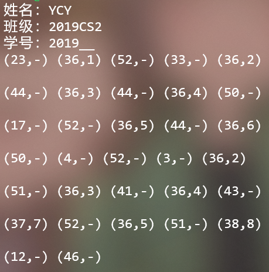
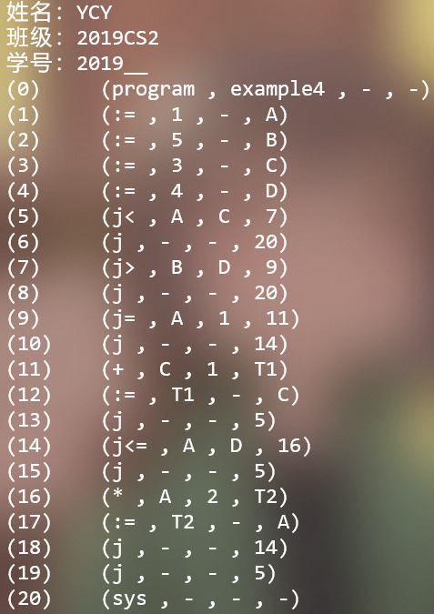
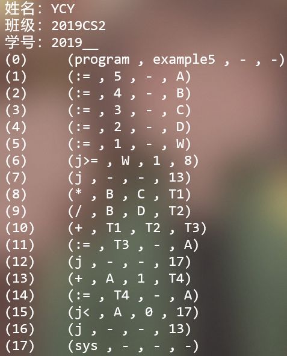

# INDEX

[TOC]

# DOCUMENTS

[SAMPLE语言的定义](./SIMPLE.MD)

[记一次编译原理实验]()

[LR1 TABLE]()

~~写README~~

~~练习英文~~

逼格√

# Environment

Python3

# DEMO







# How to use

```bash
git clone https://github.com/kabu1204/compilation.git
```

## Exp1 Lexical scanner

### Quick start

```bash
cd compilation/Exp1
python3 Scanner.py test2
```

### Use it on your own language

1. In function `__init__()`, modify `self.ReservedWords`, `self.DoubleBoundaryWords` , `self.SingleBoundaryWords` to fit your own reserved word set and delimiter set.  
2. continue to modify  other `self.something` to fit your own grammar definition

If you prefer to build your own DFA to match `identifier`, `integer`, `string constants` (I've already implemented these three :) ) or something else: 

3. derive your own DFA, get your transform matrix and fill it in `self.transform_matrix`. modify function `Analysis()` if necessary.  GOTO STEP 7.

if you'd like to make full use of python package `re`:

4. modify or add your own regular expression in function `__init__()`
5. follow the format in function `Analysis_NO_DFA()` to modify it.
6. change `self.Analysis(word)` to `self.Analysis_NO_DFA(word)` in function `__call__()`

7. test your code

## Exp2 LR(1) analyzer

### Quick start

```bash
cd compilation/Exp2
python3 LR1.py test4   # test5
```

### Use it on your own language

1. copy your brand new `Scanner.py` to compilation/Exp2, and comment your `print` sentences.
2. follow the format to modify `VT`, `VN`, `G` to fit your own grammar.
3. In function `init() (not __init__())` , `I0` is the starting LR(1) item of a extended grammar, please modify it to yours. NO NEED TO modify it to CLOSURE(I0).
4. accordingly, modify the default value of the function `BuildLR1Table(termination = ...)` ‘s parameter `termination`  PAY ATTENTION to the format
5. modify or add semantical functions in class `SemanticActions`, follow the format to modify `self.switch` in the meantime.
6. test your code

The `DrawLR1Table` will generate a `.MD` file `LR1Table.MD` , witch draw's your grammar's LR(1) item set and ACTION&GOTO table.

ATTENTION: whenever you modify your grammar in G, don't forget to add new symbols to `VT` or  `VN` 

## ISSUES

if you have any issues, find the contacts in [记一次编译原理实验]()

